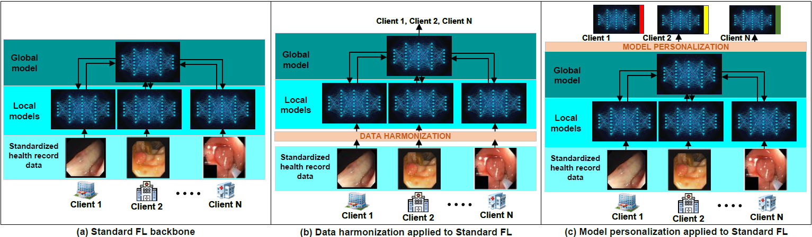

# WhenToAdapt

This is the official code repository of the paper  
**"When To Adapt: Adapting Model or Data in Federated Medical Imaging."**

---

This repository implements a controlled comparison between:

- **Model-side personalization**: FedPer, FedRep, FedBN, FedProx, SCAFFOLD, Local Finetuning  
- **Data-side harmonization**: Histogram Matching, FDA, MixStyle, CycleGAN, CUT, CoMoGAN  

within a **federated learning setup for medical imaging** across multiple tasks and modalities.

We evaluate under diverse heterogeneity types (appearance vs structural) using **6 tasks across segmentation and classification**.

---

## Comparative framework

Following is the system architecture:  


---

## Tasks and datasets

We consider **6 federated tasks**, each with 4 clients (datasets):

### 🧠 Segmentation Tasks

#### 1. Colon polyp segmentation (structural heterogeneity)
- Kvasir-SEG (1000)
- ETIS-Larib (196)
- CVC-ColonDB (380)
- CVC-ClinicDB (612)

#### 2. Skin lesion segmentation (appearance + lesion variability)
- HAM10000 (10015)
- PH2 (200)
- ISIC2017 (2000)
- ISIC2018 (2594)

#### 3. Breast tumor segmentation (cross-device ultrasound variability)
- BUS-BRA (1875)
- BUS_UC (811)
- BUSI (437)
- UDIAT (163)

---

### 🧪 Classification Tasks

#### 4. Tuberculosis CXR classification (style/scanner heterogeneity)
- Shenzhen Hospital (662)
- Montgomery County (138)
- TBX11K (1600 subset used)
- Pakistan (local dataset, 3008)

#### 5. Brain tumor classification (dataset/domain heterogeneity)
- Sartaj Bhuvaji (Kaggle) (3160)
- RM1000 (Kaggle) (7023)
- Thomas Dubail (Kaggle) (3096)
- Figshare (Cheng et al.) (7200)

#### 6. Breast tumor classification (ultrasound domain shift)
- BUS-BRA (1875)
- BUS_UC (811)
- BUSI (647)
- UDIAT (163)

---

## Highlights / Key findings

1. **Structural heterogeneity → Adapt the model**  
   In segmentation tasks like polyp and breast tumor segmentation, differences arise from geometry, shape, and anatomy.  
   → Model personalization consistently outperforms data harmonization.

2. **Appearance heterogeneity → Adapt the data**  
   In tasks like CXR classification, variation is dominated by scanner/style differences.  
   → Data harmonization significantly improves global model performance.

3. **Mixed regimes (e.g., skin, brain MRI)**  
   Neither approach dominates universally—performance depends on dataset bias and scale.

---

## What this repo provides

- Per-client data harmonization pipelines  
- Federated training framework (FedAvg + personalization methods)  
- Evaluation across segmentation and classification  
- Visualization tools:
  - Harmonized images
  - Amplified difference maps
  - Cross-client comparison grids  

---

## Requirements & setup

Create and activate environment:

```bash
conda create -n whentoadapt python=3.9 -y
conda activate whentoadapt
```

Install the requirements:

```bash
pip install -r requirements.txt
```

## Citation
If you find this project useful in your research, please cite our paper:

```bash
@article{Anonymous_2026,
  title={When To Adapt: Adapting Model or Data in Federated Medical Imaging},
  author={Anonymous},
  journal={Proceeding of XXX},
  year={2026}
}
```